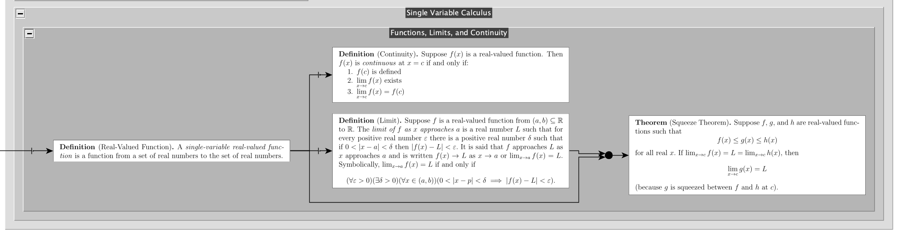

# The Map of Mathematics

Currently managed by *Matthew Anderson* ([umatthew@umich.edu](mailto:umatthew@umich.edu))

## Mission

This map of mathematics is a tool to graphically represent (and take notes on)
abstract fields of study, such as mathematics, economics, philosophy, and computer science.

The idea of a "map" of math is not especially novel.
Interesting projects such as [Metamath](https://us.metamath.org/mpeuni/mmset.html)
and [mathlib](https://github.com/leanprover-community/mathlib) have taken on
the exact challenge of mapping the interconnections between .
These tools are brilliant works of engineering, but they are only accessible to
a small set of experts.
In particular, to work with these tools, one must be intimately familar with their languages,
[Metamath language](https://us.metamath.org/mpeuni/mmset.html#proofs) and
[$L\exists\forall N$](https://leanprover.github.io/theorem_proving_in_lean/introduction.html), respectively.
Here are how Metamath and mathlib map that the square root of 2 is irrational:

- Metamath requires [94 lines of quantifier-laden statements](https://us.metamath.org/mpeuni/sqrt2irr.html),
  and the whole proof depends on an extraordinarily long list of axioms and lemmas, the latter of which
  take up 40+ lines each themselves.
- Mathlib's lean is slightly less verbose:

```lean
theorem irrational_sqrt_two : irrational (sqrt 2) :=
by simpa using nat.prime_two.irrational_sqrt

theorem irrational_sqrt_rat_iff (q : ℚ) : irrational (sqrt q) ↔
  rat.sqrt q * rat.sqrt q ≠ q ∧ 0 ≤ q :=
if H1 : rat.sqrt q * rat.sqrt q = q
then iff_of_false (not_not_intro ⟨rat.sqrt q,
  by rw [← H1, cast_mul, sqrt_mul_self (cast_nonneg.2 $ rat.sqrt_nonneg q),
         sqrt_eq, abs_of_nonneg (rat.sqrt_nonneg q)]⟩) (λ h, h.1 H1)
else if H2 : 0 ≤ q
then iff_of_true (λ ⟨r, hr⟩, H1 $ (exists_mul_self _).1 ⟨r,
  by rwa [eq_comm, sqrt_eq_iff_mul_self_eq (cast_nonneg.2 H2), ← cast_mul, rat.cast_inj] at hr;
  rw [← hr]; exact real.sqrt_nonneg _⟩) ⟨H1, H2⟩
else iff_of_false (not_not_intro ⟨0,
  by rw cast_zero; exact (sqrt_eq_zero_of_nonpos (rat.cast_nonpos.2 $ le_of_not_le H2)).symm⟩)
  (λ h, H2 h.2)

instance (q : ℚ) : decidable (irrational (sqrt q)) :=
decidable_of_iff' _ (irrational_sqrt_rat_iff q)
```

Neither of these proofs are readable, unless you are an expert in Metamath or $L\exists\forall N$—a
worthwhile pursuit for which even most expert mathematicians do not have the time or energy. The advantage, of
course, is that the proof is indubitably rigorous and can be extended to another proof by a computer.
However, if we are willing to sacrifice a modicum of rigor and are comfortable without the ability to extend
our proofs via computer search, then we can create a tool that is readable by anyone.

This Map of Mathematics is designed to meet this niche: readable by anyone, even at the expense of a tiny bit of rigor.
The benefits in readability are significant and outweigh the loss of extreme rigor.

The following screenshot is the `Function, Limits, and Continuity` section of the Single-Variable Calculus section of
the map:



There are other advantages to our version of the map of mathematics.
Besides being readable, it is visual and interactive.
This makes it a great tool for teaching and learning.
It is also easy to extend, both in terms of adding new statements and adding alternate proofs.

To our knowledge, this is the first time that a tool like this has been created.

Summarized, the motivation and mission for this project is:

1. Formalize the origins of mathematical objects
2. Make the formalization readable by anyone
3. Make the formalization interactive, visual, and engaging
4. Enhance teaching opportunities with another medium for students to learn
5. Create something that's never been done before

## Getting Started

To begin rendering the map of mathematics:

1. Clone the repository.
2. Install the dependencies from `requirements.txt` using `pip install -r requirements.txt`.
3. Run `python3 src/main.py` to render the map of math.

You can render other maps too. Try `python3 main.py -h` for more information.
Latest renders of repo-sponsored maps are in the `output/` directory;
these can be downloaded directly in place of running the software.

The file renders into `.graphml`, and to open this,
you will need the free software [yEd](https://www.yworks.com/products/yed).
Once opened, you can use the `Layout` menu to arrange the nodes in a more pleasing way;
we recommend `Hierarchical` with the `Left-to-Right` orientation, but every layout can be interesting in its own way.

## How This Software Works

### Structuring the Map

Currently, the following keys are supported on an object/statement node.
Note that each node has a key `id` that is a unique identifier for the node,
e.g. `pythag` for the Pythagorean theorem.

| Key | Description |
| --- | ----------- |
| `name` | The name of the node, e.g. `Natural Numbers` or `Pythagorean Theorem`. |
| `tex` | The $\TeX$ code for the node, e.g. `$\forall$ sets $X,$ $\|X\|\neq\|2^X\|.$` |
| `type` | The type of the node, one of `axiom`, `corollary`, `definition`, `example`, `fact`, `formula`, `lemma`, `note`, or `theorem`. |
| `predec` | A list of lists in which each element of the sublist is an `id` of a predecessor of the node, and a whole sublist represents a complete set of hypotheses from which the node follows.|
| `course` | A dictionary where each key is an institution and each value is a list of courses in which the node is taught.  |
| `flags` | A string in which each character is a tag for the node. |
| `author` | The author of the node. |
| `date` | The date that the author wrote the node. |
| `more` | A list of links to other resources about the node. |

A note on predecessors:

- If an object has a predecessor, then the predecessor is an object that is required to define the object.
For instance, the rational numbers are a set that requires the natural numbers to be defined.
Thus, the natural numbers are a predecessor of the rational numbers.
- If a statement has a predecessor, then the predecessor is a statement that is required to prove the statement.
For example, the theorem that the set of natural numbers is not a field requires
the theorem that the set of natural numbers is not a group.
Thus, the theorem that the set of natural numbers is not a group
is a predecessor of the theorem that the set of natural numbers is not a field.
- Alternatively, it may be more convenient to explain why the set of natural numbers is not a field
by referencing the definition of fields directly. In this case, the definition of fields
is a predecessor of the theorem that the set of natural numbers is not a field.
The software allows for multiple predecessors through the use of sublists. For instance:

```json
"natural-numbers-are-not-a-field": {
  "predec": [
             [natural-numbers-are-not-a-group, fields-are-also-groups],
             [definition-of-field, definition-of-natural numbers]
            ]
}
```

Type words like lemma and theorem are used loosely.
We try to use them more specifically here, as described by the following table:

| Type | Description |
| ---- | ----------- |
| `axiom` | A statement that is assumed to be true without proof. |
| `corollary` | A statement that follows simply from a theorem. |
| `definition` | A definition of an object. |
| `example` | An example of an object. |
| `fact` | A statement of equality that follows simply from a theorem, e.g. "$\mathbb{N}$ is ordered." |
| `lemma` | A specific statement that is commonly described by mathematicians as a lemma. |
| `note` | A useful note that is not required mathematical completeness; thus it cannot have successors. |
| `theorem` | A statement that is proved. |

Currently, the following institutions are supported:

| Course | Description |
| ------ | ----------- |
| `creek` | Cherry Creek High School |
| `michigan` | The University of Michigan |
| `ucdenver` | The University of Colorado at Denver |
| `stanford` | Stanford University |

Currently, the following tags are supported:

| Tag | Description |
| --- | ----------- |
| `i` | The statement is incomplete and needs review. |
| `r` | The statement's predecessors should be reviewed. |
| `p` | The statement's proof should be reviewed. |
| `e` | The statement is from an exam. |
| `h` | The statement is from a homework. |

### Storing Data

As far as the machine is concerned, all data is stored in a `json` file.
However, the `json` file is not human readable, especially when $\TeX$ is involved.
Therefore, we humans use `hjson` to interface with the data.
[`hjson` is a brilliant project](https://hjson.github.io) which does the heavy lifting for us,
and allows us to focus on writing the mathematics.
At runtime, the `hjson` file is converted to a `json` file, which is then used by the software.

Long-term, we would like to be able to store the data in a GUI, perhaps similar to Excel.
I've left a `csv2json.py` script in `maps/` if you want to write in `csv`s instead of `jsons`.

### Rendering the Map

A few things to note about the rendering:

- You must have LaTeX installed to render the map.
  View the preamble in `latex/preamble.tex` to see what packages are required.
- Depending on your computer, the first render should take several minutes.
- For each map, you will need to make the following directories to support rendering.
  The GitHub repository does not include these directories because we do not want to upload all the renders.

```bash
mkdir -p maps/__map_name__/nodes/renders
touch maps/__map_name__/renders/.log.json
touch maps/__map_name__/renders/.dimensions.json
mkdir -p maps/__map_name__/proofs/pdfs
```

## Long-Term Goals

We are hoping to take this project in a few exciting and innovative directions:

- Available as a web app that anybody can view.
- Support alternate proofs and definitions more seemlessly.
- Import definitions and theorems from a $\LaTeX$ file, such as notes or homework.
- Automatically convert the map into a set of flashcards, e.g. through [Anki](https://apps.ankiweb.net).
- Viewable in virtual reality in order to create a [memory palace](https://en.wikipedia.org/wiki/Memory_palace).

Along the way, we hope to make many small but meaningful changes.

## Contributing

Please write Matthew Anderson ([umatthew@umich.edu](mailto:umatthew@umich.edu))
if you are interested in contributing or if you have suggestions.
The project could use help in any area from anyone interested in it.

Notes:

- We use `pep8` for Python formatting.
- The `main` branch is the stable branch.
  Please make a new branch for any changes.
- I try to do my best with `git` practices.
  Please take care to use `git` responsibly:
  write good commits, make issues, maintain the `.gitignore`,
  be descriptive in your pull requests, etc.
